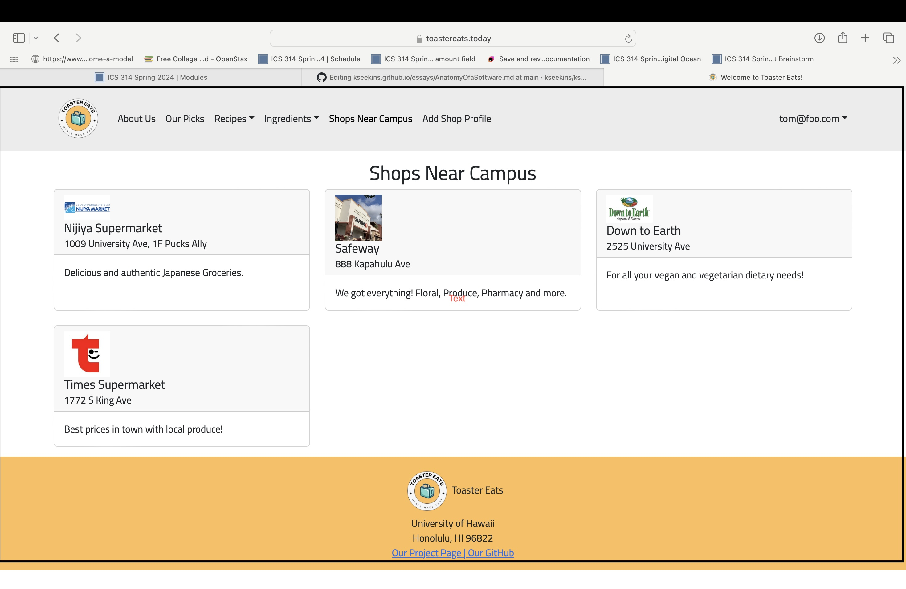

## Not Bad for 2 Weeks of HTML Design and UI Framework 

This week, I wrote a website in my software engineering class. We were to choose an actual website to emulate. In the process, I took creative liberties. The fruit of my labor is on the left: a corporate-passing website with ridiculous statements (and pictures). Then it hit me: it's so easy to fake anything online. I remember working at the Moana Surfrider front desk during COVID. To avoid quarantine, guests checking in needed to present a screenshot of the Hawaii Safe Travels website. But if I could make that cat-wearing-banana republic website look decent, couldn't anyone have replicated the Hawaii Safe Travel 'You may skip quarantine' screen?

 

## What is Real?

Having firsthand experience with a UI framework teaches us about professional-looking websites. That image of the Hawaii Travel Website is as reliable as a hand-scribbled note saying, "Heather is Covid Negative. She's clear to skip Quarantine. Thanks, Dr. Jones." Anyone can produce either. Before learning UI frameworks, I knew "theoretically" that anyone could write a nice webpage. But on an emotional level, I still trusted clean, sleek-looking websites. I would screenshot confirmation pages for records. I advised people to do the same before. Now I am not so sure.

## I Feel Old

I'm a 38-year-old returning college student. When I first went to college in 2004, I did not have a cellphone. I handwrote my college applications, then mailed them via FedEx. Over the years, I was impressed by how everything—job applications, school applications, taxes—shifted online. Learning a UI framework feels like another leap of technology to me. More technology will be easily available in the next decade. Perhaps I can make a movie of me doing a backflip. And if I can post myself doing it online, why bother to learn it in real life? Or would we evolve to distrust anything we see online?

## AI Use In this Essay

ChatGPT was only used to check spelling and grammar. 
