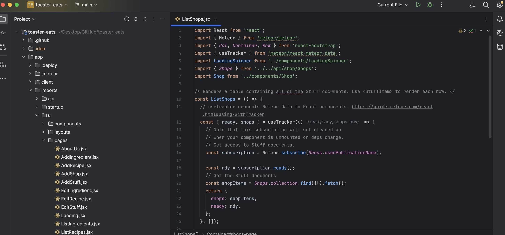

## What I had Imagined 

This webpage "Shops Near Campus" looks simple enough. It resembles a Post-it notes stuck on a board. Prior to learning Software engineering, I would have imagined a single page of codes behind this page. 





## So Many Directories and Subdirectories 

My assumption was correct to an extent- ListShops.jsx, shown just below the webpage does code for the page. However this file alone is not enough. To the left, we see a list of directories, subdirectories and files. This looked nothing but overwhelming for most of my semester. After 10 weeks of staring at them, I've started to appreciate them. The organization started to make sense. If you are intimidated by coding, this is an example that you should code anyway. 

## Translating Real world into Code 

In the real world, replicating "Shops Near Campus" is much easier. I would find a large board.  We would write and draw the information of the stores on post-its. However,there is a significant feature the code version affords; when any user adds a shop, this change is reflected to all users viewing this page. 
  ```
  const subscription = Meteor.subscribe(Shops.userPublications);
  ```
I remember years ago when my forst computer science professor quipped, "humans are pattern recognition machines". Coders have recognized patterns of how tasks are achieved or problems solved. Subscription is considered to be an "observer pattern". The local databases subscribe to a publication of up-to-date list of the Shops Collection. 

Shops collection holds all the information- the image link, location, shop name, and so on. This holds the information to be written on the Post-it. The format of how the information is presented is set by Shop.js.  We could code all this in the ListShop page. However, this "hard-coding" would make them immutable from the user end. 

## You Never Code Alone

My assumption coming into coding is that it is a solitary endeavor. I've realized that it is the opposite. Coding is a social endeavor, even if I were to write an entire application on my own. So much of what is used, from the UI framework to Meteor specific tools like "subscription" are not written by me. Coders rely on codes written by others. This dependency was demonstrated dramatically in March 23rd of 2023. Node Packge Manager (NPM) started to crash, as in irate Open Source code developer unpublished 11 lines of code that added padding before a word. NPM subsequently imposed a 24 hour limit on unpublishing. 

## Working with Others' code

Luckily, most packages we import do not require us to know "how" it works. This may not be the case when working with other coders. If another coder were to add a functionality on adding a new Store profile, he would need to know that Shops.collection stores the information for each Shop. Having a brief comment of what the code accomplishes can save a lot of time for other coders, in turn making you a more valuable coder.


## AI Use In this Essay

ChatGPT was only used to check spelling and grammar. 

## Citations

Miller, P "How an irate developer briefly broke JavaScript" May 24, 2016 theverge.com
https://www.theverge.com/2016/3/24/11300840/how-an-irate-developer-briefly-broke-javascript
