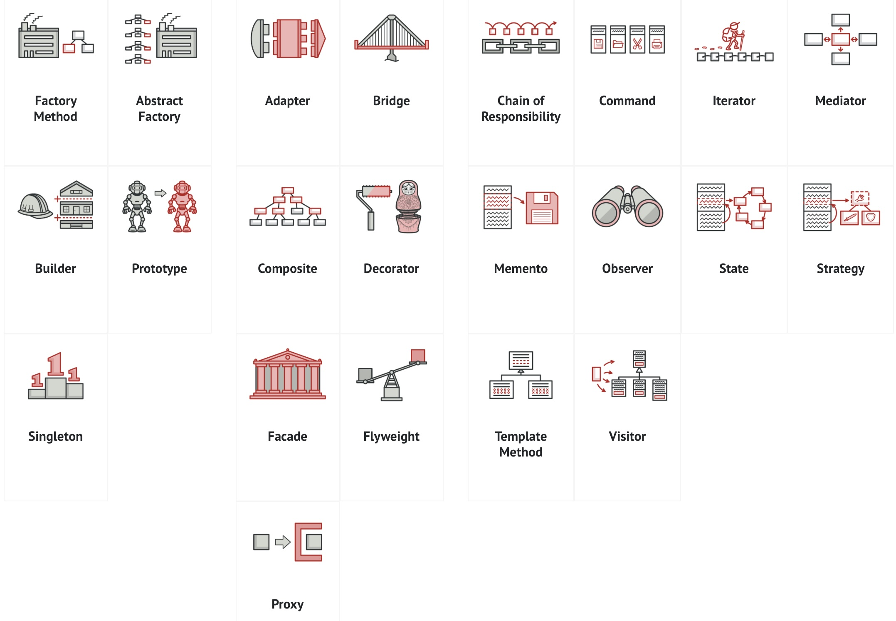

## Pedagogy of Software Development
 
ICS 314: Software Engineering is a required course for Computer Science majors at the University of Hawaii at Manoa. The latter part of the course is analogous to taking an engine apart to learn how to make it. We saw videos of instructor writing the program by modifying  pre-existing codes. We repeated what we saw, modifying a pre-existing code exactly the same, from our memory. This method exploits the fact that "homan beings are pattern-forming machines", a quote by my first computer science professor. With so much remembering by doing, we could, potentially, find patterns and principles behind how a problem is solved. That's probably what happened to the gang of 4 software developers who wrote "Design Patterns: Elements of Reusable Object-Oriented Software”. This became a canonical text outlining the common patterns in solving a coding problem.

## What is a Problem?

All problems are not necessarily interesting. For example, I am currently writing a app that shows the price of an food ingredient in the local area. I want all users to be able to update the prices they see in any given store. The challenge and art of programming is how to translate what I would tell a human intern "I want you to take  all information about prices of a tomato, and the store it was foound. Show this list of everytime when someone asks about tomatoes. Now do the same for all ingredients please." 

## I have no clue...would design patterns give me any?

Without design patterns, my first instict would be to find a code that acomplishes a similar task. I would then modify it. This is arguably not an original work of code. For a newbie programmer to advance in programming, he might need to solve this problem from the ground up. I'll attempt to solve this problem by proposing which patterns to consider in solving this problem. 

## The obvious ones

Some deisgn patterns may present themselves as obvious ingredients of the solution. First are the behvior patterns of observer and iterator. Everytime an entry for the price and location of an ingredient is inputted, we need that and all previous entries to be visible to the users. Observer is the concept of subscription- where an update listed is always published. The iterator concept would then comb through the updated list, and display relevant information. 

## Fuller Pciture 

These give us a game plan to execute a required task. We could embed a filed to submit a price tag, with information on where and how much. That price tag is added to the collection of price tag. To display all the price tags, we publish the list, and an iterator displays desired fields of "price" and "location". 

## AI Use in this Piece

ChatGPT was only used to check spelling and grammar. 
