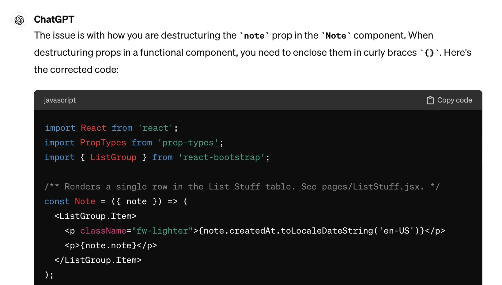

### I. Introduction 
 
My intial exposure to AI took place last year, when I consulted chatGPT for my Physics homeowork problems. I was intially impressed as chatGPT explained step by step on how it calculated the magnetic filed change of a rotating motor. However, I was quickly dismayed when I realized all of its answers were incorrect. Furthermore, when I asked the questions again, it gave different answers. I was unimpressed, but fascinated on how it came to its wrong answers. 

This spring I took a course called Information and Computer Sciences 314: Software Engineering, at the University of Hawaii at Manoa. This course emphasizes hands on coding experience, culminating in a group project to develop a web application. ChatGPT has played a major role for me in this course, proving to be a reliable source of help. 

### II. Personal Expreience with AI 
I have used AI in class this semester in the following areas:

1. Experience WODs e.g. E18
   
   We were given on average of 3 take home WODs. Short for Workout Of the Day, we were to time how long it took to code certain tasks. I did not anticipate any need for AI, as my instructors provided us videos on the solutions. On one of the WODs, however, I could not make a functionality work. I froze the video multiple times to check where I have deviated. After a couple days I thought to ask chatGPT, which immediately found the (lack of) curly brackets needed. 

2. In-class Practice WODs
   
    In-class Practice WODs were ungraded coding assignements. It served as a mock exam for the weekly WOD. For that reason I did not use AI. I wanted to see where and how I would stumble, so I could better prepare for the WOD.
   
3. In-class WODs
   
    In-class WODs were the most exciting, challenging and occasionally devastating part of this class. 100 points were awarded in a binary fashion: 100 for achieveing objectives on time, and 0 for anything else. I struggle doing anyhting- both academic and personal- tasks with speed. ChatGPT was accessible, and I would ask concise questions- for instance, on how to change a font of website I was building. I've never thought to ask it to write the whole code. 

4. Essays
     
    ChatGpt was used to check my spelling and rephrase sentences. Clearly, I could not ask chatGpt to reflect on my experiences. I was mindful in minimizing chatGpt even for editing purposes. It's tone is rational and balanced, but lacks any character in my experience.

5. Final project
   
     I've had a couple of roadblocks in coding for Toaster-Eats, a web application for health and budget minded students. One of them involved creating an additional role for vendors. I opted to watch my instructor's video in  this topic, and wrote codes in two files to create the role. It did not work, and asking chatGpt was a dead end in this case. I looked for meteor documentation on  roles, but still could not diagnose the problem. It had turned out that I needed to code in one additional file.
   
6. Learning a concept / tutorial
   
      Learning to code invovled more doing, and less attempts to conceptually understand what is coded. I would often have brod strokes ideas on what I'm coding. For ICS 314, the concepts we had to learn- such as how git works and how mongo is used- were explained well enough by our instructors. Therefore, I did not seek AI help.
   
7. Answering a question in class or in Discord
   
      I did not attempt to answer any questions I did not know. I did not see any point in using chatGpt to answer a question, as they could do that themselves. I've pointed someone to a potential issue for the tic-tac-toe extra credit project. I had coded that before and thought the he might be repeating the same error.
   
8. Asking or answering a smart-question
   
      My biggest takeaway with regards to asking smart questions was to provide a way to recreate the issue. Without that, there is only guesswork for those who are generous enough to help. I did not consult AI as I chose to think my question through so I am clear about what I am asking.
   
9. Coding example
    
      I've asked chatGPT to give examples to better understand how Javascript behaves. For instance, I've asked how to add additional properties to an object. This was useful, as my recursive code required an object to store values.
   
10. Explaining code
    
      In my final project, I had some issues understanding how my teammates wanted to implement a functionality. I found it much easier to talk to them in person for me to understand. This became harder during finals week, when we no longer had face to face meetings. I wanted to find out how their code calculated cost estimation of recipes, but could not see how. I got my answer from my teammate, as chatGPT could not locate how either. This might change if I had used a different AI tool that can scan all the files in ourn repository.
    
11. Writing code
    
      Writing a code for a web application is largely about translating our vision and ideas into an executable code. ChatGpt has not evoleved yet to a point where it can write the final project for us. This could largely be due to chatGPT being a text based AI tool. There might be other forms of AI that is tailored to design a webpage. I did not invest in finding one, as I thought it would be a form of cheating.
    
12. Documenting code
    
      Documeting code was relatively simple in this course, and I did not see the need for any AI help. However chatGpt was more diligent in code documentation, serving as a reminder for us humans to do the same.
    
13. Quality assurance
    
    This was where chatGpt contributed the most. I would type "Why is this not working?" and paste my code. My impression is that more than half of the time, chatGPT came up with a solution. This was a huge time saver for me. 

14. Other uses in ICS 314 not listed above
      

### III. Impact on Learning and Understanding:

### IV. Practical Applications:

### V. Challenges and Opportunities:

### VI. Comparative Analysis:

### VII. Future Considerations:

### VIII. Conclusion:

### AI Use in this Piece

ChatGPT was only used to check spelling and grammar. 
