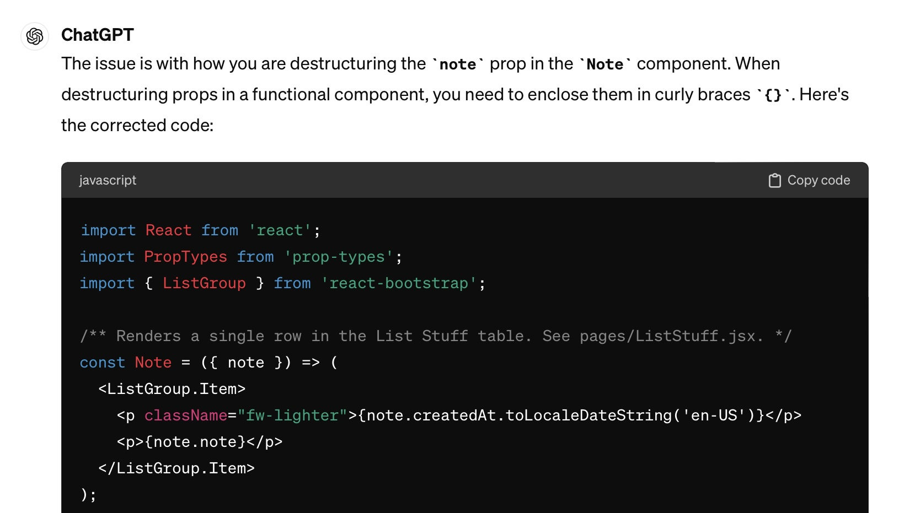

### I. Introduction 
 
My initial exposure to AI occurred last year when I consulted ChatGPT for my Physics homework problems. Initially, I was impressed as ChatGPT explained step by step how it calculated the magnetic field change of a rotating motor. However, I was quickly dismayed when I realized all of its answers were incorrect. Furthermore, when I asked the questions again, it gave different answers. I was unimpressed but fascinated by how it arrived at its wrong answers.

This spring, I took a course called Information and Computer Sciences 314: Software Engineering at the University of Hawaii at Manoa. This course emphasizes hands-on coding experience, culminating in a group project to develop a web application. ChatGPT has played a major role for me in this course, proving to be a reliable source of help.

### II. Personal Expreience with AI 
I have used AI in class this semester in the following areas:

1. Experience WODs e.g. E18
   
   We were given on average of 3 take home WODs. Short for Workout Of the Day, we were to time how long it took to code certain tasks. I did not anticipate any need for AI, as my instructors provided us videos on the solutions. On one of the WODs, however, I could not make a functionality work. I froze the video multiple times to check where I have deviated. After a couple days I thought to ask chatGPT, which immediately found the (lack of) curly brackets needed. 

2. In-class Practice WODs
   
    In-class Practice WODs were ungraded coding assignements. It served as a mock exam for the weekly WOD. For that reason I did not use AI. I wanted to see where and how I would stumble, so I could better prepare for the WOD.
   
3. In-class WODs
   
    In-class WODs were the most exciting, challenging and occasionally devastating part of this class. 100 points were awarded in a binary fashion: 100 for achieving objectives on time, and 0 for anything else. I struggle doing anyhting- both academic and personal- tasks with speed. ChatGPT was accessible during WODs, and I would ask concise questions- for instance, on how to change a font of website I was building. I've never thought to ask it to write the whole code. 

4. Essays
     
    ChatGPT was used to check my spelling and rephrase sentences. Clearly, I could not ask ChatGPT to reflect on my experiences. I was mindful in minimizing chatGpt even for editing purposes. Its tone is rational and balanced, but lacks any character in my experience. Out of curiosity, I would ask the AI to write an assigned essay. I would then compare it with mine. I feel AI has the most to catch up in this regard. I have not seen any essays from AI with a unique point of view. 

5. Final project
   
     I've had a couple of roadblocks in coding for Toaster-Eats, a web application for health and budget minded students. One of them involved creating an additional role for vendors. I opted to watch my instructor's video on  this topic, and wrote codes in two files to create the role. It did not work, and asking ChatGpt was a dead end in this case. I looked for Meteor documentation on  roles, but still could not diagnose the problem. It turned out that I needed to code in one additional file.
   
6. Learning a concept / tutorial
   
      Learning to code involved more doing, and fewer attempts to conceptually understand what is coded. I would often have broad strokes ideas on what I'm coding. For ICS 314, the concepts we had to learn - such as how Git works and how MongoDB is used - were explained well enough by our instructors. Therefore, I did not seek AI help.
   
7. Answering a question in class or in Discord
   
      I did not attempt to answer any questions I did not know. I did not see any point in using ChatGPT to answer a question, as they could do that themselves. I've pointed someone to a potential issue for the tic-tac-toe extra credit project. I had coded that before and thought he might be repeating the same error. This was just a guess, as his repository was not availbale. This leads to my next point.
   
8. Asking or answering a smart-question
   
      My biggest takeaway with regards to asking smart questions was to provide a way to recreate the issue. Without that, there is only guesswork for those who are generous enough to help. I did not consult AI as I chose to think my question through so I am clear about what I am asking.
   
9. Coding example
    
      I've asked ChatGPT to give examples to better understand how JavaScript behaves. For instance, I've asked how to add additional properties to an object. This was useful, as my recursive code required an object to store values.
   
10. Explaining code
    
      In my final project, I had some issues understanding how my teammates wanted to implement a functionality. I found it much easier to talk to them in person for me to understand. This became harder during finals week, when we no longer had face to face meetings. I wanted to find out how their code calculated cost estimation of recipes, but could not see how. I got my answer from my teammate, as ChatGPT could not locate how either. This might change if I had used a different AI tool that can scan all the files in our repository.
    
11. Writing code
    
      Writing code for a web application is largely about translating our vision and ideas into an executable code. ChatGpt has not evolved yet to a point where it can write the final project for us. This could largely be due to ChatGPT being a text-based AI tool. There might be other forms of AI that are tailored to design a webpage. I did not invest in finding one, as I thought it would be a form of cheating.
    
12. Documenting code
    
      Documenting code was relatively simple in this course, and I did not see the need for any AI help. However ChatGpt was more diligent in code documentation, serving as a reminder for us humans to do the same.
    
13. Quality assurance
    
   This was where ChatGPT contributed the most. I would type "Why is this not working?" and paste my code. My impression is that more than half of the time, ChatGPT came up with a solution. This was a huge time saver for me.

14. Other uses in ICS 314 not listed above

    I had number of run failures on GitHub, and asked ChatGPT on how to resolve it based on the error message. Based on the error message, I assumed it was an error in the YAML file, and ChatGPT seemed to back me up. My instructor and teammates correctly pointed out that the new page I had added had created a testing error. It was a potent reminder to rely on myself, not AI. 
      

### III. Impact on Learning and Understanding:

  AI can offer substantial help in toubleshooting code, pointing out small details that students can miss. It can increase efficiency by provinding an easy way to find answers to a question. This is a double edged sword, as students can get overreliant on AI tools. AI cannot fix all software issues. Overconfidence in AI might steer a student away from a solution. In my experince I had to remind myself to give myself some credit, so I'd feel more empowered to diagnose a problem. 

### IV. Practical Applications:

  AI has potential to increase the quality and availability of medical care. Professor Peter Washington's Ph.D. thesis examined the application of machine learning in crowdsourcing Autism diagnosis. Like a chef is at the mercy of her ingredients, so is machine learning to the dataset it's given. It shows how AI technology does not exist in a vacuum.  My plan is to learn more about Machine Learning in the next school year. I'm excited to learn how machine learning can help with delivery of healthcare and finding breakthroughs in therapies. 
  
### V. Challenges and Opportunities:

   A potential drawback with AI tools is the decrease of in person socialization with peers. If I could quickly get an answer for a minor question, there is less motivation for me to reach out. I've only made one friend from the 7 Computer Sciences courses I've taken. The class we met was pre-ChatGPT; He and I would meet to discuss where we were stuck. In this class, when I encountered a problem, I could ask ChatGPT for ideas. That was a blessing and a curse. I realized this quite recently, when I asked ChatGPT what kind of a person does it think I am. It gave a perfectly reasonable answer, but the correct answer was: I need to get out more. 
  

### VI. Comparative Analysis:

   In the beginning of this course, I used AI much less. As the course progressed my ChatGPT usage increased. I considered paying for the 4.0 version, but decided against it. This was in part because I felt I've felt delegated too much to ChatGPT, especially with quality assurance. I feel the coding intensive nature of this course mitigated that concern. I am confident that I can write a basic web application, if I had a template. 

### VII. Future Considerations:

  In our final class meeting, we debated a hypthetical situation in which an relatively junior programmer is promoted instead of a more experienced and well rounded programmer. In this scenario, he was promoted for his AI skills. I believe this can be a reality, even within 2024. I think ICS 314 could incorporate other AI tools, including Github pilot. Programmers might need to learn how to exploit AI to scale their productivity. 

### VIII. Conclusion:

  Sakamoto Ryoma is often hailed as one of Japan's most celebrated historical figures, revered for his pivotal role in facilitating Japan's transition from feudalism to modern governance. His efforts marked uncharted territory for Japan, symbolizing a significant era of transformation. I see parallels between Ryoma's endeavors and the realm of artificial intelligence (AI), as we currently possess  very limited insight into the potential scope of AI's impact. Will we need coders? Or any human labor? A driving force behind my pursuit of computer science lies in unraveling the implications of AI-driven changes. The trajectory of this course hints at an optimistic future characterized by heightened productivity. However, it prompts me to question: despite the continued importance of human labor, are we truly indispensable? Do my professors share this perspective? How can we make a reasonable forecast? 

### AI Use in this Piece

ChatGPT was only used to check spelling and grammar. 
