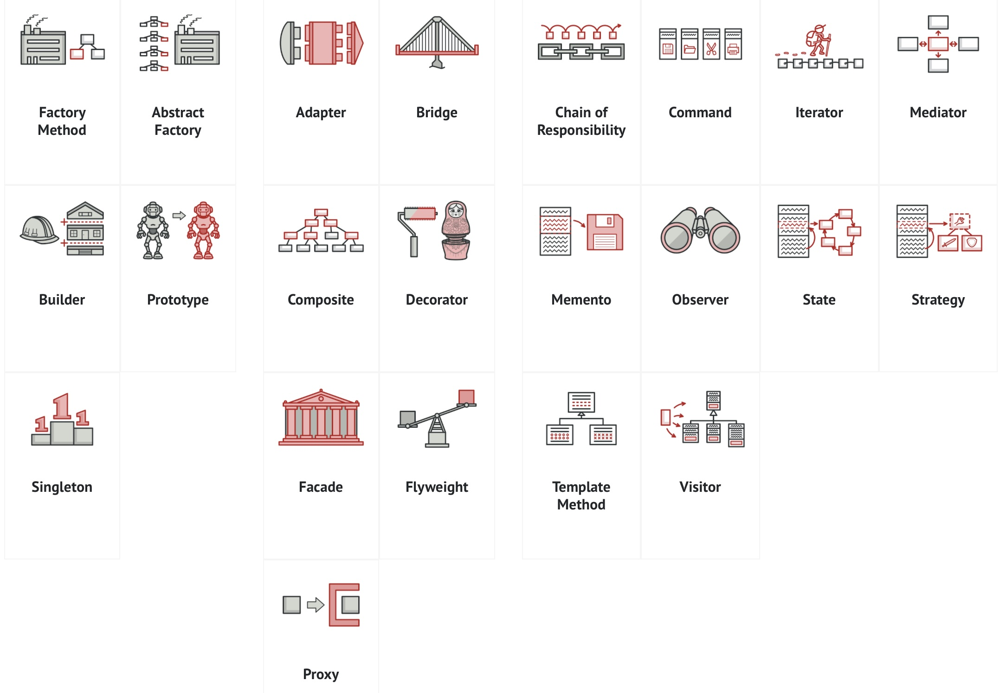

## Pedagogy of Software Development

ICS 314: Software Engineering is a required course for Computer Science majors at the University of Hawaii at Manoa. The latter part of the course is analogous to taking an engine apart to learn how to make it. We saw videos of instructor writing the program by modifying  pre-existing codes. We repeated what we saw, modifying a pre-existing code exactly the same, from our memory. This method exploits the fact that "homan beings are pattern-forming machines", a quote by my first computer science professor. With so much remembering by doing, we could, potentially, find patterns and principles behind how a problem is solved. That's probably what happened to the gang of 4 software developers who wrote "Design Patterns: Elements of Reusable Object-Oriented Software”. This became a canonical text outlining the common patterns in solving a coding problem.

 

## What is a Problem?

All problems are not necessarily interesting. For example, I am currently writing a app that shows the price of an food ingredient in the local area. I want all users to be able to update the prices they see in any given store. The challenge and art of programming is how to translate what I would tell a human intern "I want you to take  all information about prices of a tomato, and the store it was foound. Show this list of everytime when someone asks about tomatoes. Now do the same for all ingredients please." 
## I Feel Old

I'm a 38-year-old returning college student. When I first went to college in 2004, I did not have a cellphone. I handwrote my college applications, then mailed them via FedEx. Over the years, I was impressed by how everything—job applications, school applications, taxes—shifted online. Learning a UI framework feels like another leap of technology to me. More technology will be easily available in the next decade. Perhaps I can make a movie of me doing a backflip. And if I can post myself doing it online, why bother to learn it in real life? Or would we evolve to distrust anything we see online?

## AI Use In this Essay

ChatGPT was only used to check spelling and grammar. 
