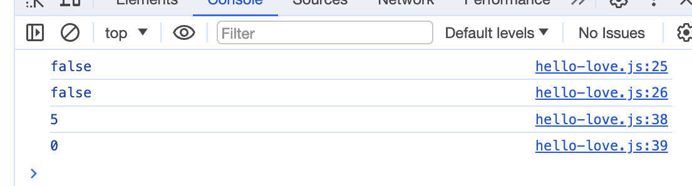

## Not bad for 2 weeks of HTML design and UI framework 

This week I wrote a website in my software engineering class. We were to choose an actual website to emulate. In the process I took creative liberties. I tweaked a bit more for this essay to give my desired effect: A corporate passing website with obviously ridiculous statements. Then it hit me: it's so easy to fake anything online. 

## Screenshots 

My closest experince outside of coding to coding standards is note taking. I noticed how I tend to write in big letters. I would often cross out words and write a correction. This is the one the more organized notes I have: 


In my own experience in calculus, physics and chemistry classes, writing neater notes has helped with comprehending the material. However sometimes I'd need to write chaotic, messy notes first. If I had time, I would rewrite it in a more organized fashion. But most of the time, my notes would never be rewritten or used. It clutters my bookshelf. 

## Coding Standards 

Learning coding standards in Computer Science has been frustrating. For instance, I spent a good couple of hours struggling to have node_modules installed on IntelliJ IDEA. I was embarassed to ask the class on Discord, espcially a week after reflecting on asking "Smart Questions".  I asked my TA in person, who pointed out that I put an extra '.'; I named a file .package.json instead of package.json. She kindly told me that many people lose hours on a missing dot. 

  
## Do I Ignore the .

Installing and getting used to the tools for code standards have been the frustrating part. That work in itself was educational; it showed how reducing ambiguity saves time and brain power. For example: 


Do we rename the files .gitignore. or gitignore? Is there a better way to differentiate if '.' or '?' are part of a program name or part of a sentence in instructions? 

## Can Coding Standard Help My Coding Exams

I went back to my failed coding exam to see if coding standrds can help debug the problem. 


This part of the code should have printed true:
```javascript

console.log(hasLove(helloLoveLyrics)); 

```
In this particular instance, my code meets all coding standards by ESLint, so coding standards did not help. They could help depending on the errors. For instance had I just mistyped the function name, ES lint would have caught an unused expression. My next step is to manipulate the _.some function; perhaps removing the toLowerCase() method:



Still no luck, love is in the song lyrics but my function can't see it. 

## AI Use In this Essay

No AI help was received to write this essay. 
