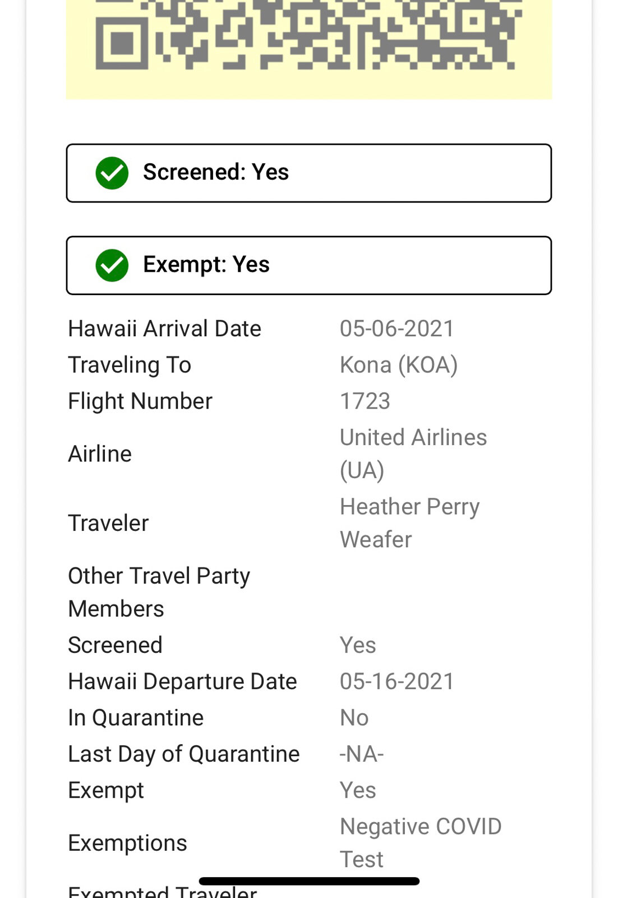

## Not bad for 2 weeks of HTML design and UI framework 

This week I wrote a website in my software engineering class. We were to choose an actual website to emulate. In the process I took creative liberties. The fruit of my labor is on the left: A corporate passing website with ridiculous statements (and picture). Then it hit me: it's so easy to fake anything online. I remember working at the Moana Surfrider front desk during COVID. To avoid quarntine, guests checking in needed to present a screenshot of the Hawaii Safe Travels website. But if I could make that cat-wearing-banana republic website look decent, couldn't anyone have replicated the Hawaii Safe Travel "You may skip quarntine" screen?

 


##  You Decide
Having first hand experience with UI Framework teaches us about professional looking websites; That image of Hawaii Travel Website is as reliable as hand scribbled note saying "Heater is Covid Negative. She's clear to skip Quarantine. Thanks, Dr. Jones". Anyone can produce either. Before learning UI frameworks I knew "theoretically" that anyone could write a nice webpage. But on an emotional level, I still trusted clean, sleek looking websites. I would screenshot confirmation pages for records. I advised people to do the same before. Now I am not so sure. 

## Coding Standards 

Learning coding standards in Computer Science has been frustrating. For instance, I spent a good couple of hours struggling to have node_modules installed on IntelliJ IDEA. I was embarassed to ask the class on Discord, espcially a week after reflecting on asking "Smart Questions".  I asked my TA in person, who pointed out that I put an extra '.'; I named a file .package.json instead of package.json. She kindly told me that many people lose hours on a missing dot. 

  
## Do I Ignore the .

Installing and getting used to the tools for code standards have been the frustrating part. That work in itself was educational; it showed how reducing ambiguity saves time and brain power. For example: 


Do we rename the files .gitignore. or gitignore? Is there a better way to differentiate if '.' or '?' are part of a program name or part of a sentence in instructions? 

## Can Coding Standard Help My Coding Exams

I went back to my failed coding exam to see if coding standrds can help debug the problem. 


This part of the code should have printed true:
```javascript

console.log(hasLove(helloLoveLyrics)); 

```
In this particular instance, my code meets all coding standards by ESLint, so coding standards did not help. They could help depending on the errors. For instance had I just mistyped the function name, ES lint would have caught an unused expression. My next step is to manipulate the _.some function; perhaps removing the toLowerCase() method:


Still no luck, love is in the song lyrics but my function can't see it. 

## AI Use In this Essay

No AI help was received to write this essay. 
