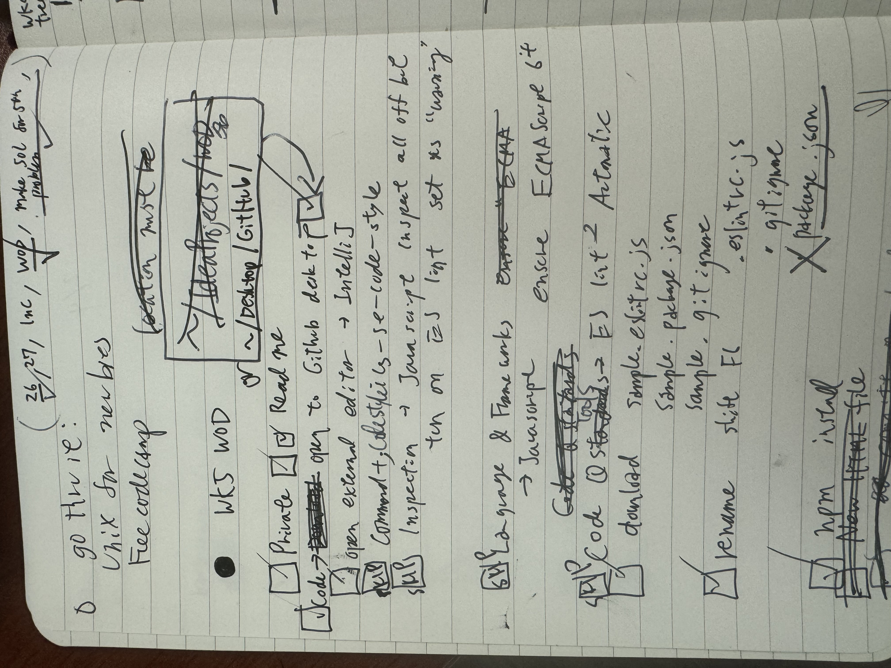
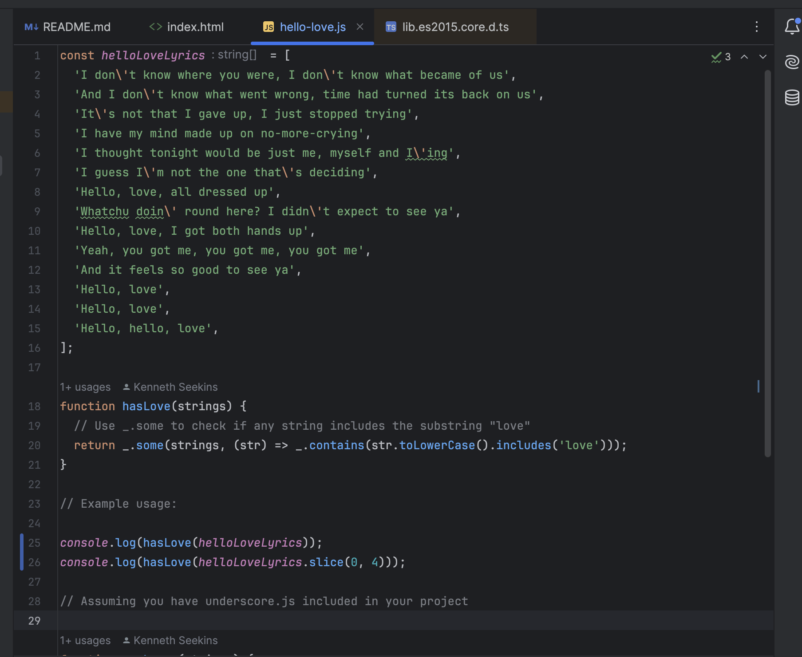

*Will I do school better if I think better?*

Today we had an in class exam that involved: 1) coding a function that returns true when 'love' is in a string; 2) complying with ES lint coding standards. Despite preparing for the exam and liking the subject, I failed. I'm slower in doing things in general- in another example, I would almost always be the last student to be done in organic chemistry lab. It makes me wonder if there are other forms of intelligence than completing a given task quickly. If we could display our minds in console windows, would more academically successful students have easier to read code then mine?

## Notes

My closest experince outside of coding to coding standards is note taking. I noticed how I tend to write in big letters. I would often cross out words and write a correction. This is the one the more organized notes I have: 

In my own experience in calculus, physics and chemistry classes, writing neater notes has helped with comprehending the material. However sometimes I'd need to write chaotic, messy notes first. If I had time, I would rewrite it in a more organized fashion. But most of the time, my notes would never be rewritten or used. It clutters my bookshelf. 

## Coding Standards 

Learning coding standards in Computer Science has been frustrating. For instance, I spent a good couple of hours struggling to have node_modules installed on IntelliJ IDEA. I was embarassed to ask the class on Discord, espcially a week after reflecting on asking "Smart Questions".  I asked my TA in person, who pointed out that I put an extra '.'; I named a file .package.json instead of package.json. She kindly told me that many people lose hours on a missing dot. 

  
## Do I Ignore the .

Installing and getting used to the tools for code standards have been the frustrating part. That work in itself was educational; it showed how reducing ambiguity saves time and brain power. For example: 

Do we rename the files .gitignore. or gitignore? Is there a better way to differentiate if '.' or '?' are part of a program name or part of a sentence in instructions? 

## Can Coding Standard Help My Coding Exams

I went back to my failed coding exam to see if coding standrds can help debug the problem. 

'''

console.log(hasLove(helloLoveLyrics)); 

'''
