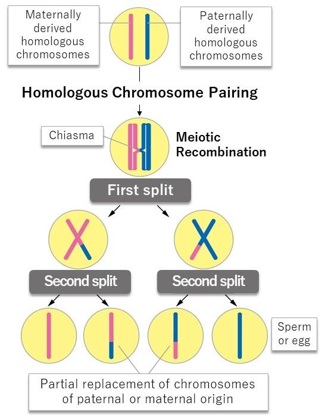
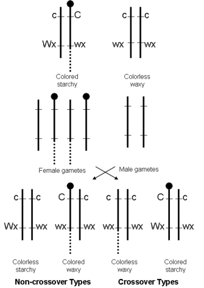

## Studying Computer Science at University of Hawaii at Manoa 

Information and Computer Sceince (ICS) majors at University of Hawaii at Manoa (UHM) are taught Java in the beginning. We are then introduced to Javascript. I've always wondered why it was so. I wished that they would teach Python instead of Java, since much of the machine learning research uses Python. So far, I finshied the 3rd week of ICS 314: Software Engineering. It has focued on Javascript. Now I suspect that we were taught Java first to highlight the differences programming languages can have. 

## Protptypical Object Creation and Mitosis  

One of the differnces between Java and Javascript is how objects are created. In Javascript, objects are created from other objects. Analogy used in our class was mitosis. All the cells in our body are created from cell division. We focused on mitosis for simplicity, as meiosis involves 2 succesive divisions and gene recombination. Just like a daugher cell receiving the same DNA as the mother cell, objects created from a previously existing object (the prototype)  inherits all its methods. 

## But How about Meiosis?

Could that similarity mean that prototypical object orientation can simulate how DNA is passed down? For instance, can it silmulate the process of meiosis? In meiosis, a diploid parent cell is divided twice to make 4 haploid gamete cells. Diploid cells have two copies of every gene, while haploid contains just one of each. Sperm and egg cells are gamete cells, and they combine to create a new diploid cell, a zygote that develops into a new individual. Chromosomes can physically cross over and and swap, creating a new combination of Genes. 

In this process, a new combinations of traits are made. 

Here we see the divergence, or the limit of the analogy. In Javascript, a new object inherits the functions of the prototype. It can then add new functions of it's own.  In gene recobination, there is no added functionality. It's as if two objects are trading parts of their prototypes. Mutating prototypes is highly discouraged in Javascript, as it annulls how Javascript optimize property accesses. A possible work around of this problem is to consider functions as gene positions, instead of the genes themselves. 

## Final Note of Studying ICS at UHM

ICS 314: Software Engineering is a required course for ICS majors at UHM. The class does not revolve around exams, but weekly WODs: an in class timed programming assignment. Professor Johnson has compared it to Project Runway. It is a reality TV show of budding fashion designers who are given curve ball assignemnets to create garments in a time crunch. I appreciated him comparing this course to my favorite TV show. It has made me realize that being a student is all about optimizing the scarce time we have. 

## References

Fujiwara, Y., Horisawa-Takada, Y., Inoue, E., Tani, N., Shibuya, H., Fujimura, S., ... Ishiguro, K. (2020). Meiotic cohesins mediate initial loading of HORMAD1 to the chromosomes and coordinate SC formation during meiotic prophase. PLOS Genetics, 16(9), e1009048. 
doi:10.1371/journal.pgen.1009048

© 2008 Nature Education Adapted from Sharp, L. (1934) Introduction to Cytology (McGraw–Hill, New York), pp. 303, 330, 333 (2008). All rights reserved.  

Object.setPrototypeOf()- Javascript: MDN MozDevNet [link](https://developer.mozilla.org/en-US/docs/Web/JavaScript/Reference/Global_Objects/Object/setPrototypeOf) Accessed January 26th 2024

