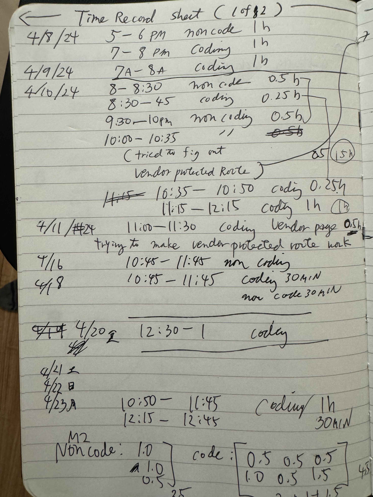

## Making a Schedule

Over a decade ago, I took a workshop on how time management. The facilitator asked us to make a schedule for a week, and I got immediately overwhelmed. The other studetns seem to have no problem. I pretended that I made the schedule. I was disgnosed for ADHD later, and somtimes wonder if my impulsivity and lack of focus have anything to my inability to plan. Dr. Alok Kanojia, a psychiatrist with a large following on YouTube attributes "ADHD inertia" to the lack of ability to sequence events. I found this exercise helpful; I was gradually able to see my coding tasks as concrete tasks, instead of something vague and amorphous. 

## Estiimation Trends 

What was clear from the data is I had spent more time on non-coding work in the beginning stages of the project. I spent time researching how to add a third role to the system. This invovled asking multiple people in addition to watching videos avaible on the course website. I also spent time strategizing how the application could reach its objectives. As my team "filled in the blanks" by producing more code, there was less guess work to be done. Majority of time I referred to the recorded time it took to finish a similar assignemnt.  It was clear during the second week of the estimation- track that I overestimated the time for my issues. This helped to make a more accurate forecast for the remainder of the semester. 

## Troubleshooting

Resolving an issue was a wildcard when it came to effort estimation. In the beginning, finding out how to establish a thrid role in the system took a lot more time than expected. This caused time spent on Issue 7 and 25 to go far above expected. However when AddShop page could not add anything new to the shops.collection, I found the solution within 30 minutes. 

## Tracking

At the start of thie estimation project, I downloaded Toggl. However I could not make it work. Back then I was facing a number of issues running all of my code in my laptop. I did not want a potential complication so decided to use my personal journal that I carry with me all the time. Transcribing them to the Project Dashboard on Github was not a problem. I do not think this compromised the accuracy of the data. I look forward to applying this practice in the next semester, even for non-computer sciences courses. Most classes involve more of "abosorbing" information- including reading textbooks and reviewing lecture notes. How to apply the concept of issue-based project management in them will be the question going forward. 

## AI Use In this Essay

ChatGPT was only used to check spelling and grammar. 

## Citations

Kanojia, A. "Is this an ADHD thing?" Youtube.com, uploaded by HealthyGamerGG, uploaded December 11th 2023 [video link](https://www.youtube.com/watch?v=2AagWXtg4gY)
