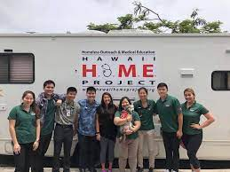

 

HOME Prject, Houseless Outreach and Medical Education clinic is a free clinic for houseless patients on Oahu. It is run by John A. Burns School of Medicine at University of Hawaii at Manoa. 

The aim of the task force is to help us better connect We have two main objectives. First is to gain approval for the clinic to access the O'ahu Homeless Management Information System (HMIS). We will be presenting to Partners in Care on how we can contribute to the county wide effort to connect houseless patients to housing, medical care and other resources. 

Another objective is to create an up to date manual on how to assist houseless patients. This will focus on connecting patients with case workers, housing and food. As a clinical volunteer, I feel the resouces avaiable for houseless patients have dwindled and harder to find especially with city's gentrification efforts in Chinatown, Honolulu. But with information on resources scattered, that is harder to show. 
