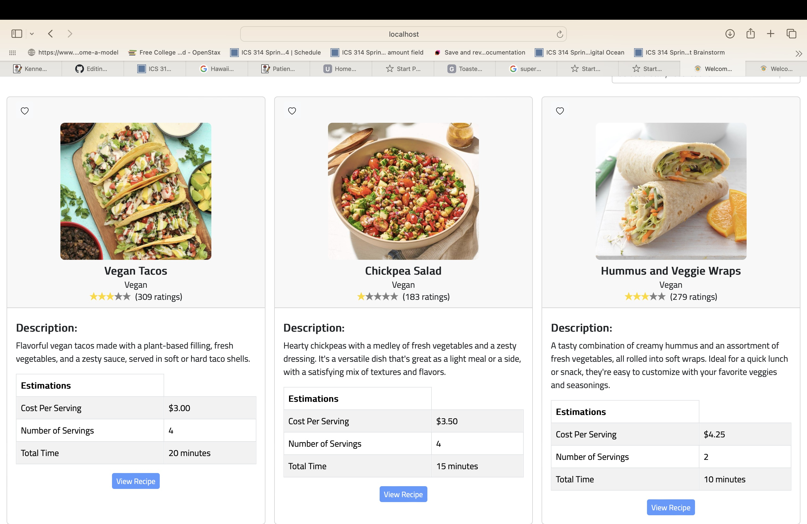

As a final project for ICS 314: Software Engineering, my team created a web application using JavaScript. Users can browse and contribute recipes tailored to dietary preferences and what cooking applicances are available for them. We aggregated pricing of ingredients from local vendors. The aim of the application is to give students tool to plan and cook their meals on real time information on ingredients availability and costs. The vendors are incentivized to contribute, as they gain an additional way to market to University of Hawaii students. 

 

You can learn more at  [at out project website](https://toaster-eats.github.io).
