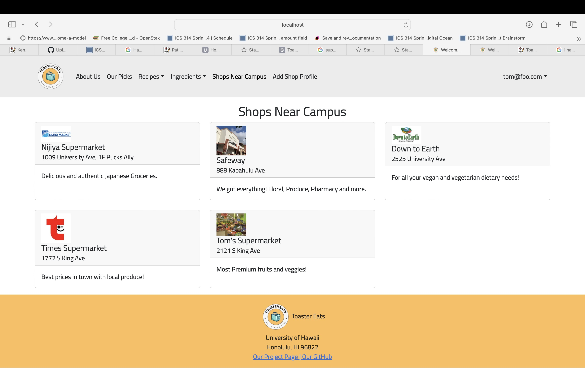

As a final project for ICS 314: Software Engineering, my team created a web application using JavaScript. Users can browse and contribute recipes tailored to dietary preferences and what cooking applicances are available for them. We aggregated pricing of ingredients from local vendors. The aim of the application is to give students tool to plan and cook their meals on real time information on ingredients availability and costs. The vendors are incentivized to contribute, as they gain an additional way to market to University of Hawaii students. 

My contributions focused on the vendor side of this website. First, I made the landing pages tailored to different roles of users. I made a section of the website "Shops Near Campus" that lists the grocery stores around campus. I have set up the vendor role, then created an AddShop page so a vendor can add a profile of their shop. This would be then visible to "Shops Near Campus" to all users. This is a snapshot of when "Tom's supermarket" is added. 

You can learn more at  [at out project website](https://toaster-eats.github.io).

このプロジェクトはハワイ大学のソフトウェア工学の授業（ICS 314）の最終課題として開発しました。
学生が食事を計画しやすくするために、レシピ共有機能や食材の価格・入手可能性を確認できるWebアプリを作成しました。
私は主にベンダー機能を担当し、「キャンパス周辺の店舗」ページの実装や、新規店舗を追加できるAddShopページを開発しました。
詳しくはこちらの[サイト](https://toaster-eats.github.io)で記載しております。
