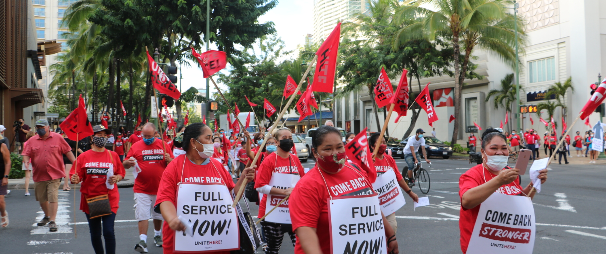

 

Organizing petitions and protests for hotel owners to contribute to local 5 employee health coverage. Conducting work place safety inspections.  Reporting to the local 5 and hotel owners on areas of improvement to prevent workplace Covid 19 infections. Asking hotel management for clarifications on their Covid-19 related policies, such as sick leave, as a part of local 5 delegation. 
